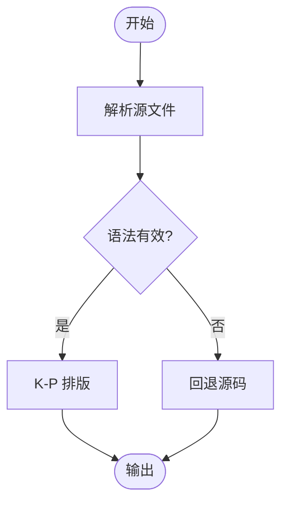
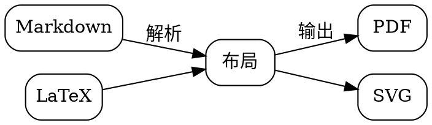

# 流程图

Mermaid 与 DOT 代码会被识别成矢量图，进入与 TikZ 相同的路径后端。

```mermaid
flowchart TD
  start([开始]) --> parse[解析源文件]
  parse --> check{语法有效?}
  check -->|是| layout[K-P 排版]
  check -->|否| error[回退源码]
  layout --> done([输出])
  error --> done
```

```dot
digraph pipeline {
  rankdir=LR;
  node [shape=box, style="rounded,filled", fillcolor="#ffffff"];
  md [label="Markdown"]; tex [label="LaTeX"];
  lay [label="布局"]; pdf [label="PDF"]; svg [label="SVG"];
  md -> lay [label="解析"];
  tex -> lay;
  lay -> pdf [label="输出"];
  lay -> svg;
}
```
