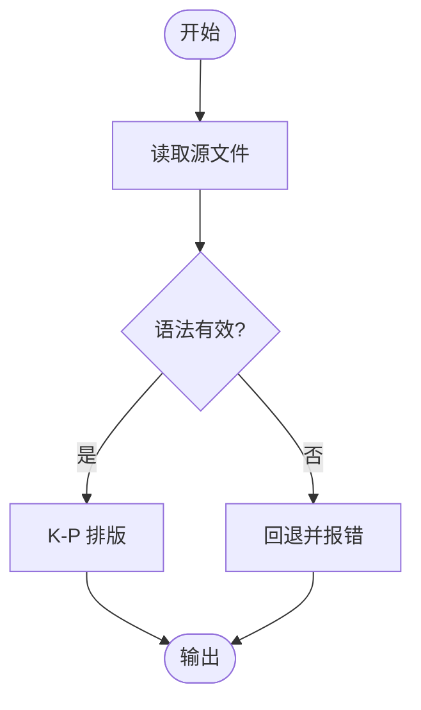
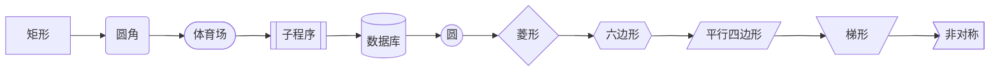
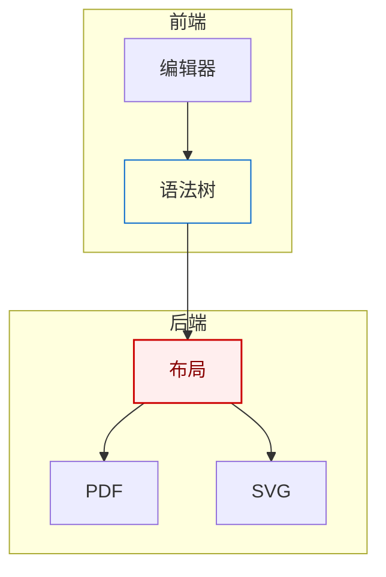
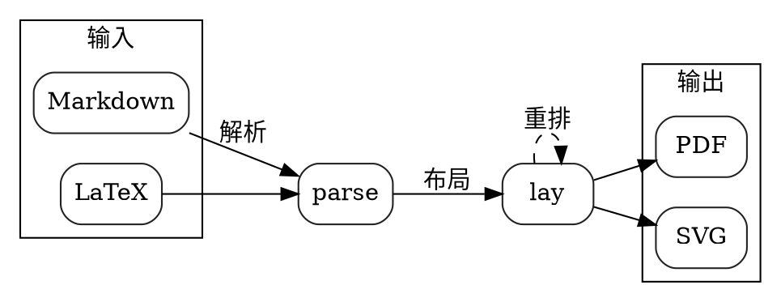

# 流程图与图代码

这一页验证模型生成的 Mermaid/DOT 代码如何进入同一套矢量排版。

## 决策流程


```mermaid
flowchart TD
  start([开始]) --> parse[读取源文件]
  parse --> check{语法有效?}
  check -->|是| layout[K-P 排版]
  check -->|否| report[回退并报错]
  layout --> done([输出])
  report --> done
```

## 形状


```mermaid
flowchart LR
  a[矩形] --> b(圆角) --> c([体育场]) --> d[[子程序]] --> e[(数据库)] --> f((圆)) --> g{菱形} --> h{{六边形}} --> i[/平行四边形/] --> j[\梯形/] --> k>非对称]
```

## 子图与样式


```mermaid
flowchart TB
  subgraph 前端
    ui[编辑器] --> ast[语法树]
  end
  subgraph 后端
    lay[布局] --> pdf[PDF]
    lay --> svg[SVG]
  end
  ast --> lay
  classDef hot fill:#ffeeee,stroke:#cc0000,stroke-width:1.5px,color:#880000
  class lay hot
  style ast fill:none,stroke:#0066cc
```

## DOT


```dot
digraph pipeline {
  rankdir=LR;
  node [shape=box, style="rounded,filled", fillcolor="#ffffff", color="#222222"];
  subgraph cluster_in { label="输入"; md [label="Markdown"]; tex [label="LaTeX"]; }
  subgraph cluster_out { label="输出"; pdf [label="PDF"]; svg [label="SVG"]; }
  md -> parse [label="解析"];
  tex -> parse;
  parse -> lay [label="布局"];
  lay -> pdf;
  lay -> svg;
  lay -> lay [label="重排", style=dashed];
}
```

## 未标注围栏

```
flowchart LR
  x[未标注] --> y[也能识别]
```

## 强制代码

```text
flowchart TD
  A --> B
```
